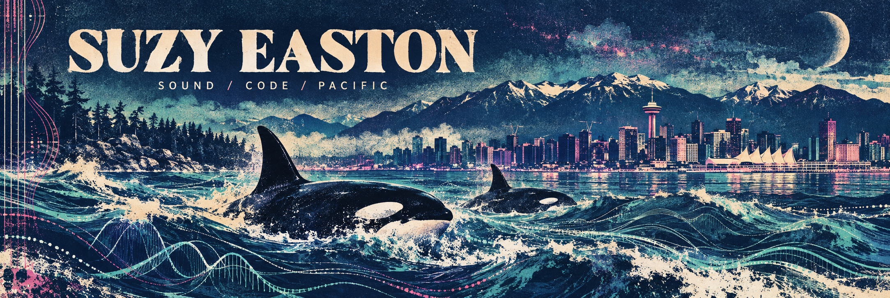

  

# hey, i'm suzy.

**Vancouver born. Bass player. Creative coder. Still making noise.**

I make instruments, strange little worlds, and software that earns its place. My background runs through touring bands, recording with Steve Albini, QA automation, IT operations, and applied AI. Music is the thread through all of it.

Lately: what if a laptop could be an instrument you write as you play? What if a toaster could become one too?

### on the workbench

**The Appliance Latent Space** · An experimental instrument in progress: a toaster, my own recorded sounds, sensors, and local AI. Building toward a live performance at [Futureproof](https://www.futureproof.website/). [BC + AI Ecosystem](https://github.com/bc-ai-ecosystem)

**Music through code** · Exploring playable systems for composition, sound, and visuals. An instrument that fits in a backpack.

**[The public lab](https://github.com/suzyeaston/suzyeastonca)** · Music tools, practical automation, Vancouver experiments, and things that got interesting enough to build.

**[City Space Adventure](https://github.com/suzyeaston/city-space-adventure)** · A little retro-futurist escape, built in Python and Pygame.

### behind the noise

Python · JavaScript / TypeScript · Bash · PowerShell · SQL  
Automation · APIs · cloud systems · creative AI · audio experiments

I like understanding how things work, finding the weird edge, and making something useful there.

### pacific frequency

Part of [DCTRL](https://www.dctrl.wtf/), Vancouver's hacker community. Inspired by places like [Basecamp](https://basecampyvr.ca/) that give people room to build.

[suzyeaston.ca](https://suzyeaston.ca/) · [explore the repos](https://github.com/suzyeaston?tab=repositories)

*Saltwater. Low frequencies. Source code.*
