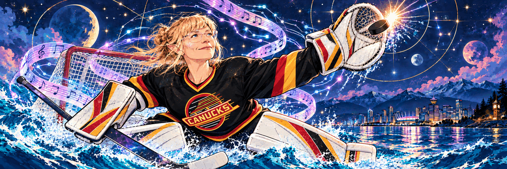

  

# hey, i'm suzy.

**Vancouver born. Bass player. AI strategist. Creative technologist. Still making noise.**

I build practical systems, strange interfaces and instruments that blur software, music, local AI and the physical world. My path here runs through touring bands, recording with Steve Albini, QA automation, IT operations, cloud systems and applied AI.

Right now the lab has a center of gravity:

> **make the computer feel like an instrument, make the toaster part of the band, and make the surrounding intelligence local, inspectable and mine.**

## current signal · october 2026

### 🛰️ The Appliance Latent Space · P0

A programmable audiovisual instrument moving toward a live set at **Futureproof Festival of AI** in Vancouver.

**Hard date:** **October 29, 2026 · 13:25** at the H.R. MacMillan Space Centre.

The software instrument already plays. Now I’m making it feel like a live object: personal sounds, performance capture, MIDI, and an **ESP32 inside the toaster turning the lever and browning dial into wireless Bluetooth gestures**. The Mac stays the brain. The toaster becomes the controller.

→ [public performance repo](https://github.com/suzyeaston/appliance-latent-space-live)

### 🧠 SUZY//AI

A local-first open intelligence core: shared event protocol, timelines, private world model and replaceable future model/runtime layers.

**Open machinery. Personally owned intelligence.**

→ [suzyeaston/suzy-ai](https://github.com/suzyeaston/suzy-ai)

### 🌐 SUZY//WORLD

The deliberately public knowledge layer for SUZY//AI. It currently lives as a WordPress plugin/API, beginning with versioned album reviews and cultural knowledge.

→ [suzyeaston/suzy-world](https://github.com/suzyeaston/suzy-world)

### 👁️ POP//CONTEXT

A local audiovisual evidence pipeline exploring how software might understand culture as more than transcripts with pictures attached.

→ [suzyeaston/pop-context](https://github.com/suzyeaston/pop-context)

### 🌊 Basecamp / continuity

I’m currently building from a creative residency at Jericho Beach while developing a private capture and continuity system for field notes, decisions, experiments and the connective tissue between projects.

The private systems stay private. The useful public artifacts graduate outward deliberately.

## mission control

I finally have enough simultaneous experiments that “what am I actually working on?” deserves its own file.

→ **[PROJECTS.md](PROJECTS.md)** · all 13 repos, status, priorities, open work and deadlines  
→ **[latest project audit](notes/2026-10-04-project-audit.md)** · why the current priorities look the way they do

## the public lab

[suzyeaston.ca](https://suzyeaston.ca/) is the bigger workshop. Current and recent experiments include:

- **Lousy Outages** · independent outage intelligence for AI/cloud/creative tools
- **Vancouver Tech Events** · local event discovery
- **Salish Sea / YVR radar** · browser-based listening and place interface
- **Loop Lab** · browser music / recording experiments
- **Gastown Simulator** · civic data, sound and browser-world building
- **Track Analyzer** · AI-assisted feedback for musicians
- **MACHINE VISIONS** · public AI-art exhibition layer
- **Skywhale Airways** · psychedelic film + web world with Kris Krüg

→ [public site repository](https://github.com/suzyeaston/suzyeastonca)

## behind the noise

Python · JavaScript / TypeScript · Bash · PowerShell · PHP · SQL  
Automation · APIs · cloud systems · QA · local AI · audio · creative tooling

I like finding the part of a vague problem that can actually be built, tested, broken and made useful.

## pacific frequency

Part of [DCTRL](https://www.dctrl.wtf/) and the Vancouver creative-tech / AI community.

[suzyeaston.ca](https://suzyeaston.ca/) · [all repositories](https://github.com/suzyeaston?tab=repositories)

*Saltwater. Low frequencies. Source code.*
